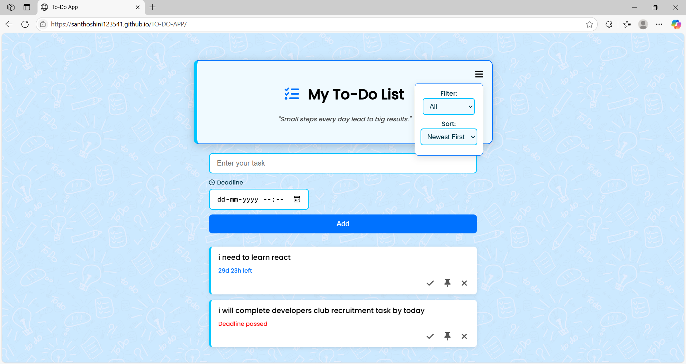

# 📝 My To-Do List App

This is a beautiful and useful *To-Do List Web App* made using *HTML, **CSS, and **JavaScript*. It helps you organize your tasks with features like deadlines, filters, sorting, pinning, and completion tracking.

---

## 📌 Features

- ✅ *Add new tasks* with optional deadline
- 📌 *Pin tasks* to keep important ones at the top
- ✔ *Mark tasks as completed*
- 🗑 *Delete tasks*
- 🔍 *Filter tasks* (All / Completed / Incomplete)
- 🔃 *Sort tasks* (Newest First / Oldest First)
- 💾 *Saves tasks in your browser* using localStorage
- 📆 *Shows deadline and time left*
- 🎨 Stylish UI with animations and motivational quotes

---

## 📸 Screenshot

---

## 🚀 How to Use

1. *Open the app in a browser* (index.html)
2. Type a task in the input box
3. Choose a deadline using the calendar
4. Click the *"Add"* button to save the task
5. Use the ☰ (menu icon) to filter or sort tasks
6. Use the icons beside each task:
   - ✅ Check icon to mark complete/incomplete
   - 📌 Pin icon to move task to top
   - ❌ Cross icon to delete

---

## 📂 Files

- index.html – Main HTML structure
- style.css – All styling and animations
- script.js – JavaScript logic and task handling
- background.jpeg – Background image (optional)
- screenshot.png – Add a screenshot for GitHub preview

---

## 💡 Tip

> "Small steps every day lead to big results."  
> A motivational quote is shown every time to keep you going!

---

## 🌐 Live Demo 

You can host it easily on:

- [GitHub Pages](https://santhoshini123541.github.io/TO-DO-APP/)

---

## 👩‍💻 Made With

- HTML5  
- CSS3  
- Vanilla JavaScript  
- Font Awesome Icons  
- Google Fonts (Poppins)

---

## 📜 License

Free to use and modify for learning or personal use.
